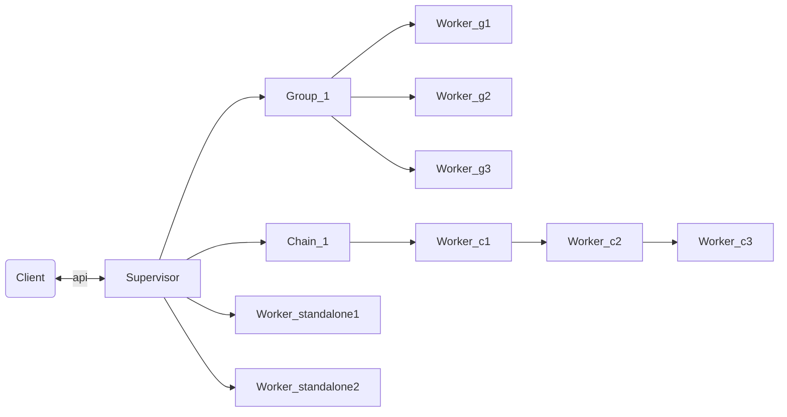
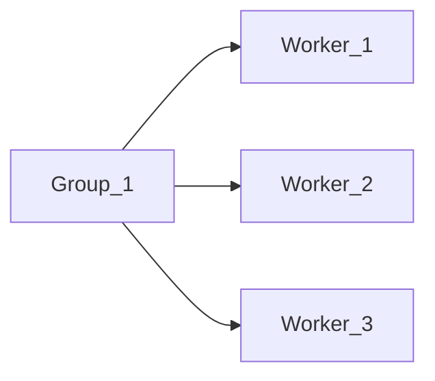
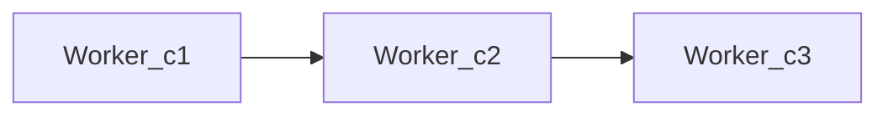
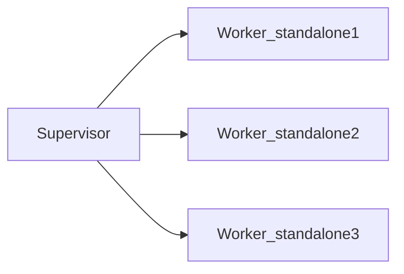

# Intro

The library support for auto scale & distritubed for Elixir application.
Help dev can easily work with concurrency.

*Note: Library is still developing, please don't use for product.*

## Guide

Just declare function for worker (task) and input (in param or stream) and run.
Library is created for dev can add workers in runtime without care too much about design supervisor tree.
It's matched with dynamic typed language like Elixir.

## Features

Support new kind of process, chain processes is made for easy create a powerful stream processing.

## Supervisor

Support three type of processes in one supervisor. Can declare by config or add in runtime.

**Type of processes:**

- Group processes
- Chain processes
- Freedom processes

### Group processes

All processes in supervisor have same group_id.
If a process in group is crashed, all other processes will be died follow.
Avoid using trap_exit in process to avoid side effect.

Support send message to worker or broadcast to all workers in a group. Dev don't need to implement a way for transfer data to worker.

### Chain processes

Support chain task type. The data after process in a process will be passed to next process in chain.
If a process is crashed, all other process in chain will be die follow.

From foreign process data can pass to chain (first worker in chain or directly to a worker with id) by Supervisor APIs.

Can config function to call in the end of chain or self implement code in the last worker in the chain.

### Standalone processes

This for standalone worker run in supervisor, it has owner restart strategy.
If a standalone worker is crashed, it doesn't affect to other standalone workers or workers in group/chain.

## Planned features

- Support GenServer.
- Callback module for easy understand & implement.
- Multiprocess per chain node.
- Auto scale for chain.
- Distributed in cluster.
