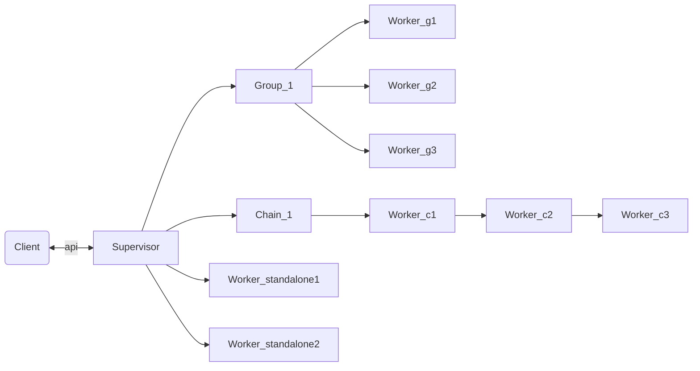
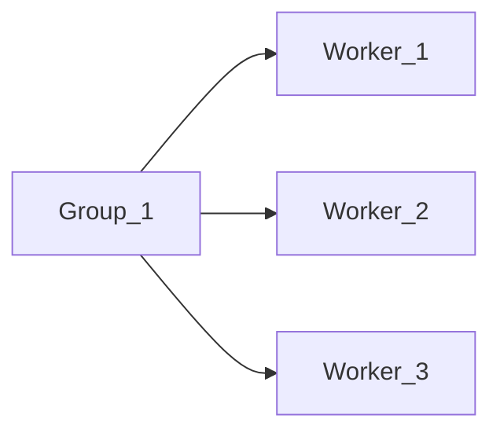
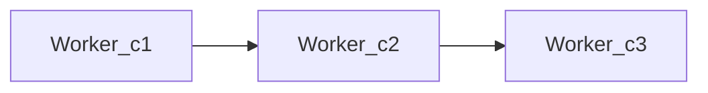
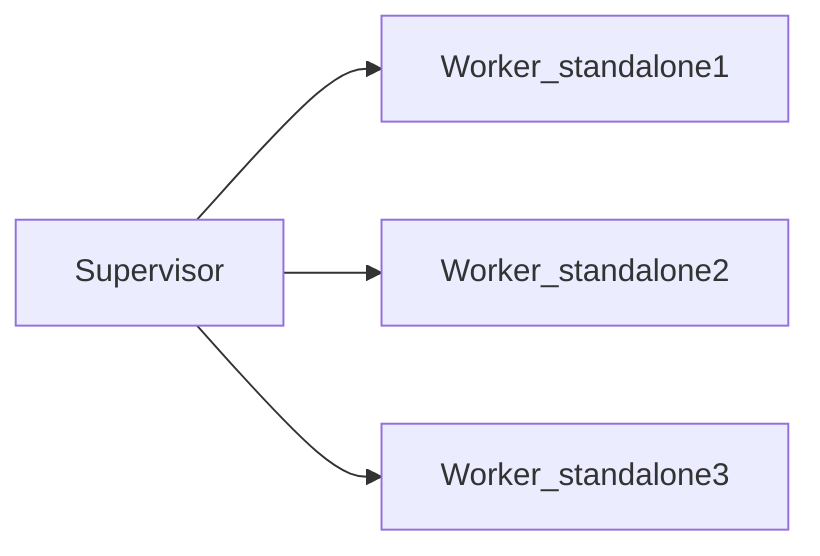
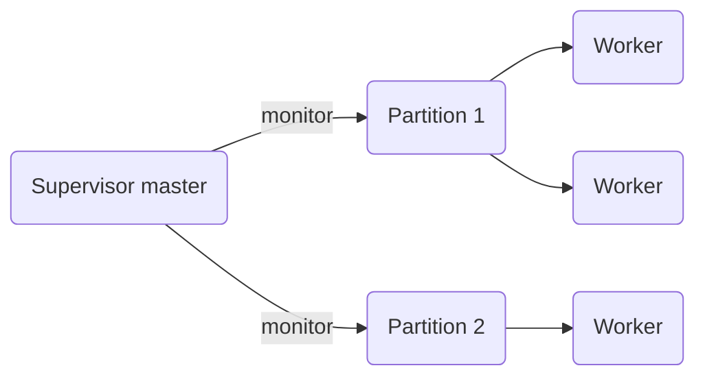

# Intro

The library support for newbies work with process & supervisor in Elixir.
Easy to add & identify processes in system.

*Note: Library is still unstable, please don't use for product.*

## Guide

Just declare function for worker (task) and input (in param or stream) and run.
Library is created for dev can add workers in runtime without care too much about design supervisor tree.
It's matched with dynamic typed language like Elixir.

## Features

Group processes for easy to maintain and communitcate with group.

Chain processes for work with multi steps or stream processing by process.

Standalone processes for add new process & interact with processes by id.

Each Group/Chain/Standalone process has it restart strategy.

## Supervisor

Support three type of processes in one supervisor. Can declare by config or add in runtime.


```mermaid
graph LR
Client(Client) <-->|api| Supervisor
    Supervisor--> Group_1
    Supervisor--> Chain_1
    Supervisor-->Worker_standalone1
    Supervisor-->Worker_standalone2
    Group_1-->Worker_g1
    Group_1-->Worker_g2
    Group_1-->Worker_g3
    Chain_1-->Worker_c1
    Worker_c1-->Worker_c2
    Worker_c2-->Worker_c3
```

**Type of processes:**

- Group processes
- Chain processes
- Standalone processes

### Group processes

All processes in supervisor have same group_id.
If a process in group is crashed, all other processes will be died follow.
Avoid using trap_exit in process to avoid side effect.

Support send message to worker or broadcast to all workers in a group. Dev don't need to implement a way for transfer data to worker.


```mermaid
graph LR
    Group_1-->Worker_1
    Group_1-->Worker_2
    Group_1-->Worker_3
```

### Chain processes

Support chain task type. The data after process in a process will be passed to next process in chain.
If a process is crashed, all other process in chain will be died follow (depend restart strategy of chain).

From foreign process data can pass to chain (first worker in chain or directly to a worker with id) by Supervisor APIs.

Can config function to call in the end of chain or self implement code in the last worker in the chain.


```mermaid
graph LR
    Worker_c1-->Worker_c2
    Worker_c2-->Worker_c3
```

### Standalone processes

This for standalone worker run in supervisor, it has owner restart strategy.
If a standalone worker is crashed, it doesn't affect to other standalone workers or workers in group/chain.


```mermaid
graph LR
    Supervisor-->Worker_standalone1
    Supervisor-->Worker_standalone2
    Supervisor-->Worker_standalone3
```

## Fault tolerance

Workers are spread over one or more partitions. Each partition is monitored by
the supervisor master, so failures are contained and recovered automatically:

- a crashing **worker** is restarted by its partition following the restart
  strategy of its parent (standalone / group / chain). Workers on other
  partitions are never affected;
- a crashing **partition** is restarted individually — the supervisor and all
  other partitions keep serving requests;
- every partition watches the master process, so nothing outlives the
  supervisor itself.


```mermaid
graph LR
    Master(Supervisor master) -->|monitor| P1(Partition 1)
    Master -->|monitor| P2(Partition 2)
    P1 --> W1(Worker)
    P1 --> W2(Worker)
    P2 --> W3(Worker)
```

## Introspection & observability

Running supervisors can be discovered and inspected at runtime:

```elixir
# All supervisors started by the library on this node.
Sup.running_supervisors()
# [{:sup1, #PID<0.200.0>}]

# Partition health + counts of groups/chains/workers.
{:ok, info} = Sup.supervisor_info(:sup1)
info.num_groups
info.partitions |> Enum.all?(& &1.alive?)

# List groups/chains/standalone workers with their configuration.
{:ok, groups} = Sup.list_groups(:sup1)
{:ok, chains} = Sup.list_chains(:sup1)
{:ok, workers} = Sup.list_standalone_workers(:sup1)
```

## Utilities

The library ships a few small focused helpers:

- `SuperWorker.CircuitBreaker` — protect external calls with a closed/open/
  half-open circuit. The protected function runs in the caller process, so
  slow calls never block the breaker:

  ```elixir
  SuperWorker.CircuitBreaker.call(:external_api, fn ->
    Req.get("https://api.example.com")
  end)
  ```

- `SuperWorker.TermStorage` — thin `:persistent_term` wrapper for rarely
  changing node-wide data.

- `SuperWorker.Supervisor.Utils.safe_call/1,3` — invoke user functions without
  letting exceptions escape:

  ```elixir
  {:error, {:error, %RuntimeError{}}} = Utils.safe_call(fn -> raise "boom" end)
  ```

## Planned features

- Multiprocess per chain node.
- Auto scale for chain.
- Distributed in cluster.


## Support AI agents & MCP

Run this command for update guide & rules from deps to repo for supporting ai agents in dev.

```bash
mix usage_rules.sync AGENTS.md --all \
  --link-to-folder deps \
  --inline usage_rules:all
```

Run this command for enable MCP server

```bash
mix tidewave
```

Config MCP for agent `http://localhost:4115/tidewave/mcp`, changes port in `mix.exs` file if needed. Go to [Tidewave](https://hexdocs.pm/tidewave/) for more informations.
