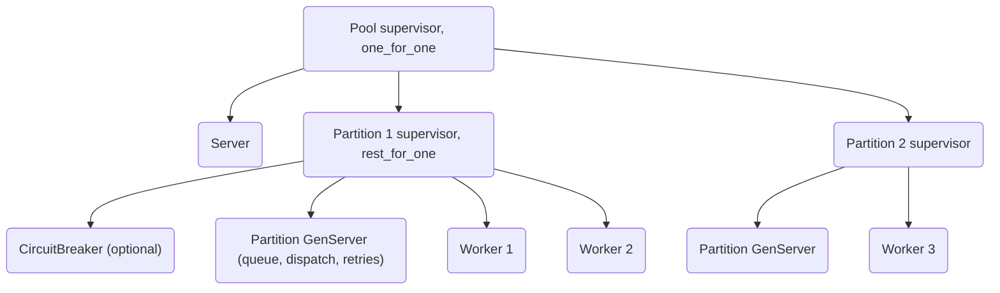

# SuperWorker Pool Guide

`SuperWorker.Pool` is a simple, partitioned process pool for Elixir. Hand it a
function, an MFA or a worker module, then submit jobs — no supervision tree to
design, no message protocols to implement, no OTP knowledge required.

This is a **single-node, in-memory pool**: queued jobs survive worker crashes
and partition restarts, but not a node crash, and there is no cross-node
distribution. For durable, cross-node jobs use a persisted queue (e.g. Oban)
instead — or put a persisted layer behind `:on_failure`.

## Overview

Key properties:

- **Partitioned** — workers and queues are split over `partitions` independent
  bottlenecks; jobs are routed by round robin or by hashing the job.
- **Backpressure** — each partition has a bounded queue (`max_queue`);
  overflow submissions immediately fail with `{:error, :overloaded}`.
- **Retries with backoff** — `{:retry, reason, state}` from a worker
  reschedules the job (via `Process.send_after`, never `Process.sleep`) until
  `max_attempts`; `{:error, reason, state}` is a final failure.
- **Crash isolation** — a worker crash restarts only that worker; its in-flight
  job is requeued once (poison-pill safe), at the **front** of its partition
  queue, and charged to its retry budget; after retries are exhausted,
  `:on_failure` fires — no silent job loss.
- **Retried jobs are not starved** — a retried job re-enters the **front** of
  its partition queue when its backoff delay elapses. The delay itself is
  inherent to retries, so a job submitted during the delay can still complete
  first; `:hash` routing keeps a job and its retries on the same partition
  (order-sensitive), but does not promise strict FIFO across retries.
- **Pluggable middleware** — Plug-style pipeline around job execution;
  `Telemetry` and `CircuitBreaker` ship as built-ins.

## Architecture

The pool is partitioned: workers and the job queue are split over
`partitions` (default: `System.schedulers_online()`) independent bottlenecks,
each holding `ceil(size / partitions)` workers. A job is routed to a partition
by round robin or by hashing the job term (`:erlang.phash2`) — hash routing
gives partition affinity for order-sensitive jobs. Each worker is a supervised
process, so a crash restarts just that worker.



The **queue lives in the `Partition` GenServer** — a process sibling of the
workers under each partition supervisor, not in the supervisor itself. It owns
the bounded FIFO queue, dispatches jobs to idle workers, schedules retries
(`Process.send_after` + `SuperWorker.Pool.Backoff`), requeues jobs after
worker crashes, and dead-letters exhausted jobs. See
`SuperWorker.Pool.Partition`.

## Quick start

```elixir
# 1. A bare function
{:ok, _} =
  SuperWorker.Pool.start_link(
    name: MyPool,
    task: fn job -> do_work(job) end,
    size: 20
  )

# 2. An MFA (the job is prepended to the args)
{:ok, _} =
  SuperWorker.Pool.start_link(name: MyPool, task: {MyMod, :process, []}, size: 20)

# 3. A stateful worker module (holds a connection, a buffer, ...)
{:ok, _} =
  SuperWorker.Pool.start_link(
    name: MyPool,
    worker: MyApp.ImageResizer,
    size: 20
  )
```

Submitting jobs:

```elixir
{:ok, result} = SuperWorker.Pool.run(MyPool, job)      # sync: blocks until done
{:ok, result} = SuperWorker.Pool.run(MyPool, job, timeout: 5_000)
{:ok, ref} = SuperWorker.Pool.run_async(MyPool, job)   # Task-like ref
{:ok, result} = SuperWorker.Pool.await(ref)
{:ok, result} = SuperWorker.Pool.await(ref, 5_000)     # custom timeout
:ok = SuperWorker.Pool.cast(MyPool, job)               # fire-and-forget

SuperWorker.Pool.stop(MyPool)
```

**Timeouts**: `run/3` and `await/2` take a `timeout` in ms (default: 30_000).
When the caller gives up, the job keeps running — only the result is dropped.

## Options

```elixir
SuperWorker.Pool.start_link(
  name: MyPool,                  # required, atom
  task: fn job -> ... end,       # required, mutually exclusive with :worker
  worker: MyApp.ImageResizer,    # SuperWorker.Pool.Worker behaviour module
  worker_opts: [],               # keyword passed to the worker's init/1
  size: 20,                      # total workers (default: schedulers online)
  partitions: 4,                 # default: schedulers online
  routing: :round_robin,         # :round_robin | :hash
  max_queue: 1_000,              # per-partition queue bound
  retry: [
    max_attempts: 5,
    backoff: {:exponential, base: 200, max: 10_000, jitter: true}
  ],
  on_failure: {MyApp.DeadLetter, :store, []},  # called as (job, reason)
  # for casts: called as (job, {:ok, result} | {:error, reason}) — both
  # outcomes, including permanent failures (the error reason is the same one
  # :on_failure would receive)
  on_result: {MyApp.Notifier, :done, []},
  middleware: [
    SuperWorker.Pool.Middleware.Telemetry,
    SuperWorker.Pool.Middleware.CircuitBreaker
  ],
  circuit_breaker: [failure_threshold: 5, reset_timeout: 10_000],
  # restart-intensity ceiling shared by the pool supervisor and each
  # partition supervisor: a worker crash-looping in init/1 burns this budget
  # and then takes its partition down instead of spinning forever
  max_restarts: 10,
  max_seconds: 10
)
```

- When `size < partitions`, workers are rounded up so no partition is dead.
- `:routing: :hash` routes by `:erlang.phash2(job, partitions) + 1`.
- Submissions beyond `max_queue` fail immediately with `{:error, :overloaded}`
  instead of growing unbounded.

## Stateful workers

Implement the `SuperWorker.Pool.Worker` behaviour to keep state (a connection,
a buffer, ...) across jobs:

```elixir
defmodule MyApp.ImageResizer do
  @behaviour SuperWorker.Pool.Worker

  @impl true
  def init(opts), do: {:ok, open_connection(opts)}

  @impl true
  def handle_job(job, conn) do
    case resize(conn, job) do
      {:ok, result, conn} -> {:ok, result, conn}
      {:timeout, conn} -> {:retry, :timeout, conn}   # transient: try again
      {:invalid, conn} -> {:error, :invalid, conn}   # final: fail the job
    end
  end
end
```

A crash of a worker loses its behaviour state — `init/1` runs again on
restart.

## Running a FunctionChain through the pool

`SuperWorker.Pool.FunctionChain` is a ready-made worker that runs a
`SuperWorker.FunctionChain` for every job — fanning chain runs out over the
pool's partitions:

```elixir
chain =
  SuperWorker.FunctionChain.new()
  |> SuperWorker.FunctionChain.add(:fetch, {MyApp.Users, :fetch, []})
  |> SuperWorker.FunctionChain.add(:normalize, fn user -> {:ok, normalize(user)} end)

{:ok, _} =
  SuperWorker.Pool.start_link(
    name: MyChainPool,
    worker: SuperWorker.Pool.FunctionChain,
    worker_opts: [
      chain: chain,          # %SuperWorker.FunctionChain{} or fun/0
      run_opts: [],          # keyword, or fun/1 job -> keyword (per-job arg_overrides/context)
      on_error: :error       # :error (default) | :retry — failed run vs pool retry budget
    ],
    size: 20
  )

{:ok, result} = SuperWorker.Pool.run(MyChainPool, %{id: 123})
```

- The chain's own per-step retry strategies run first; a still-failed run is
  then either failed (`:error`, the pool's `:on_failure` fires) or handed to
  the pool's retry budget (`:retry`).
- A raising chain is normalized to `{:error, {:exception, exception}}` — it
  never crashes the worker.

See the [FunctionChain Guide](../function_chain/FUNCTION_CHAIN_GUIDE.md).

## Error handling & durability

Two separate concerns, handled differently:

- **Worker crashes** (bugs, `raise`, exits): the worker is restarted by its
  partition supervisor and its in-flight job is **requeued once** — at the
  **front** of its partition queue — and charged against its own retry budget;
  a poison-pill job cannot crash-loop the pool.
- **Expected failures** (`{:error, ...}` / `{:retry, ...}`): never crash
  anything. `{:retry, ...}` reschedules after a backoff delay; after
  `max_attempts` the `:on_failure` callback fires.

`run/2` returns `{:error, reason}` where `reason` is the job's error, or one of:

| Reason                   | Meaning                                              |
|--------------------------|------------------------------------------------------|
| `:overloaded`            | Queue bound exceeded                                 |
| `:timeout`               | `run/2` timed out                                    |
| `{:retries_exhausted, reason}` | Retry budget spent                             |
| `{:worker_crashed, reason}` | Worker crashed while running the job             |
| `:circuit_open`          | CircuitBreaker middleware rejected the job           |
| `:pool_not_found`        | Unknown pool name                                    |
| `:pool_unavailable`      | Pool is starting/stopping                            |

| `cast/2` drops the result unless `:on_result` is configured (overloaded casts
are dropped with a warning log).

**`:circuit_open` vs `:on_failure`**: a job rejected by the circuit breaker
(`check_enqueue/2`) never enters the queue and never runs, so `:on_failure`
does **not** fire for it — the rejection is returned to the caller (and
dropped, with a warning, for casts). `:on_failure` is only the source of truth
for jobs that ran and finally failed (exhausted retries or a final worker
crash).

**Durability is in-memory only**: queued jobs survive worker crashes and
partition restarts, but NOT a node crash. If jobs must survive `kill -9`, put a
persisted layer behind `:on_failure` (or use a durable queue such as Oban for
the pipeline instead of this pool).

## Middleware

`SuperWorker.Pool.Middleware` is a Plug-style behaviour wrapping job
execution. Built-ins:

- `SuperWorker.Pool.Middleware.Telemetry` — emits `[:super_worker, :pool, *]`
  telemetry events for job lifecycle and retries (see the table below).
- `SuperWorker.Pool.Middleware.CircuitBreaker` — opens the circuit after
  `failure_threshold` consecutive failures and half-opens after
  `reset_timeout` ms.

`call/3` runs **in the worker process** — a crash inside a middleware is
treated as a worker crash (the job is requeued). Two optional callbacks:

- `check_enqueue/2` — invoked before a job is queued; return `:ok` to accept
  or `{:error, reason}` to reject the submission (used by the circuit breaker
  to fail fast with `{:error, :circuit_open}`).
- `notify/3` — invoked when a job reaches a final outcome: `:ok` or
  `{:error, reason}` (retries in flight are not reported).

Roll your own for rate limiting, request-id propagation, etc.:

```elixir
defmodule MyApp.Pool.RequestId do
  @behaviour SuperWorker.Pool.Middleware

  @impl true
  def call(job, meta, next) do
    Logger.metadata(job_id: meta.job_id)
    next.(job, meta)
  end
end
```

## Introspection

```elixir
{:ok, info} = SuperWorker.Pool.info(MyPool)
info.size                 # 20
info.partition_details    # per-partition queue/worker state
```

## Telemetry events

| event                                        | measurements           | metadata |
|----------------------------------------------|------------------------|----------|
| `[:super_worker, :pool, :job, :start]`       | `%{system_time}`       | pool, partition, job_id, attempts |
| `[:super_worker, :pool, :job, :stop]`        | `%{duration}` (native) | ..., status (`:ok\|:error\|:retry`) |
| `[:super_worker, :pool, :job, :exception]`   | `%{duration}` (native) | ..., kind, error |
| `[:super_worker, :pool, :job, :retry]`       | `%{}`                  | ..., delay, reason |
| `[:super_worker, :pool, :job, :crash]`       | `%{}`                  | ..., reason |
| `[:super_worker, :pool, :job, :dead_letter]` | `%{}`                  | ..., reason |
| `[:super_worker, :pool, :overloaded]`        | `%{}`                  | pool, partition, job_id (nil) |

The first three come from the `Telemetry` middleware (job execution, in the
worker process); the rest are emitted by the partition process — no
middleware needed.

## Testing

For deterministic tests start a single-worker pool and run jobs
synchronously:

```elixir
{:ok, _} =
  SuperWorker.Pool.start_link(
    name: TestPool,
    task: fn job -> ... end,
    size: 1,
    partitions: 1
  )

{:ok, result} = SuperWorker.Pool.run(TestPool, job)
```

Avoid `cast/2` and multi-worker pools in assertions on ordering: jobs may run
on any worker, in any order.

## Next steps

- [Supervisor Guide](../supervisor/SUPERVISOR_GUIDE.md) — groups, chains and standalone workers.
- [FunctionChain Guide](../function_chain/FUNCTION_CHAIN_GUIDE.md) — composable in-process pipelines.
