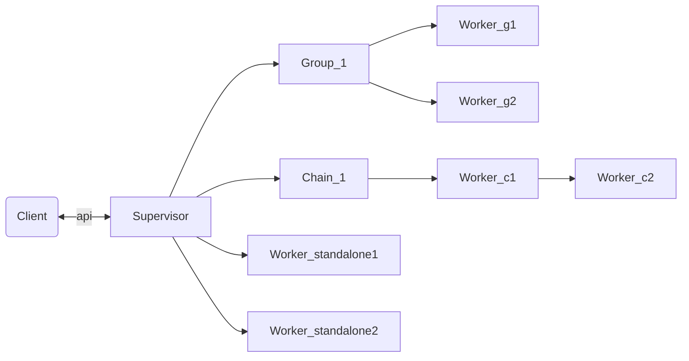
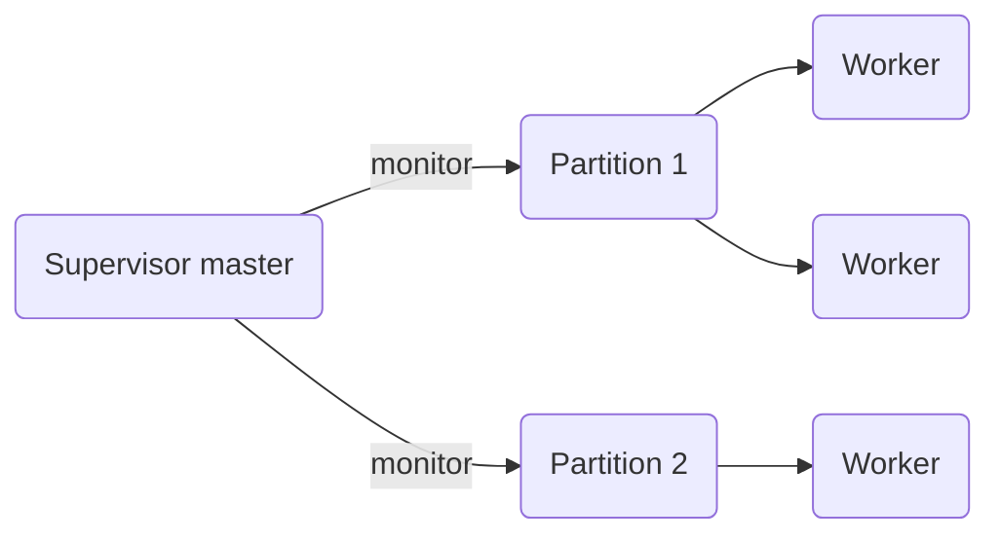

# SuperWorker Supervisor Guide

`SuperWorker.Supervisor` is an all-in-one supervisor for Elixir applications. It
supports three kinds of processes — groups, chains and standalone workers — that
can be declared in config or added at runtime, each with its own restart
strategy, and addressed directly by id.

## Overview

One supervisor manages an arbitrary mix of process types:



| Type         | Purpose                                              | Restart strategies                 |
|--------------|------------------------------------------------------|------------------------------------|
| `:group`     | A set of workers sharing a group id                  | `:one_for_one`, `:one_for_all`     |
| `:chain`     | Ordered workers where each passes data to the next   | `:one_for_one`, `:one_for_all`, `:rest_for_one` |
| `:standalone`| Independent worker with its own strategy             | `:permanent`, `:transient`, `:temporary` |

The restart strategy only applies to crashes: normal exits, `:shutdown` and
`:terminate` are not restarted.

## Concept

Each supervisor has one master process plus a number of partition processes.
When a supervisor API is called, the master picks a partition and forwards the
request to it, so a high volume of workers/requests does not bottleneck a single
process.

Worker, group, chain and runtime information is kept in an ETS table shared by
the partitions.

## Fault tolerance

Workers are spread over one or more partitions. Each partition is a plain
process monitored by the supervisor master:

- a crashing **worker** is restarted by its partition according to the restart
  strategy of its parent (standalone/group/chain) — one bad worker never
  affects workers on other partitions;
- a crashing **partition** is detected via a monitor and restarted
  individually; the rest of the supervisor keeps serving requests;
- partitions monitor the master, so nothing survives the supervisor itself;
- link semantics with the process that started the supervisor are standard: an
  abnormal exit of that process stops the supervisor, a `:normal` exit does not.



## Quick start

```elixir
alias SuperWorker.Supervisor, as: Sup

# Start a supervisor with 2 partitions.
{:ok, _} = Sup.start_with_config([id: :sup1, num_partitions: 2, link: false])
```

Supervisor options:

```elixir
[
  id: :sup1,                # atom id, used by every API call
  num_partitions: 2,        # default: System.schedulers_online()
  link: false,              # link the supervisor to the caller (default: true)
  report_to: []             # pids/callbacks to report worker events to
]
```

## Groups

All processes in a group share the same group id. Group workers support
broadcasting and direct messaging without any custom message protocol.

```elixir
# Add groups in runtime (also possible in config).
{:ok, _} = Sup.add_group(:sup1, [id: :group1, restart_strategy: :one_for_all])
{:ok, _} = Sup.add_group_worker(:sup1, :group1, {Dev, :task, [15]}, [id: :g1_1])

# A group with an anonymous function worker.
{:ok, _} =
  Sup.add_group(:sup1, [id: :group2, restart_strategy: :one_for_one])

{:ok, _} =
  Sup.add_group_worker(:sup1, :group2, fn ->
    receive do
      {:ping, ref, from} -> send(from, {:pong, ref})
      _ -> :ok
    end
  end, [id: :g2_2])

# Messaging
ref = make_ref()
Sup.send_to_group_worker(:sup1, :group2, :g2_2, {:ping, ref, self()})
Sup.broadcast_to_group(:sup1, :group1, {:reload, :config})
Sup.send_to_group_random(:sup1, :group1, {:work, job})   # any idle-ish worker

receive do
  {:pong, ^ref} -> :ok
end
```

Group API summary:

| Function                            | Purpose                                    |
|-------------------------------------|--------------------------------------------|
| `add_group/2`                       | Create a group                             |
| `add_group_worker/4`                | Add a worker (fun, MFA or module)          |
| `send_to_group_worker/4`            | Message a specific worker by id            |
| `send_to_group_random/3`            | Message a random worker in the group       |
| `broadcast_to_group/3`              | Send to all workers in the group           |
| `count_workers_in_group/2`          | Number of workers                          |
| `get_pid_group_worker/3`            | Get a worker's pid                         |
| `restart_group_worker/3`, `restart_group/2` | Manual restarts                    |
| `remove_group_worker/3`, `remove_group/2`   | Removal                            |

## Chains

Chain workers run in order: the output of one process is passed to the next.

```elixir
{:ok, _} = Sup.add_chain(:sup1, [id: :chain1, restart_strategy: :one_for_one])
{:ok, _} = Sup.add_chain_worker(:sup1, :chain1, {MyApp.Step1, :run, []}, [id: :c1])
{:ok, _} = Sup.add_chain_worker(:sup1, :chain1, {MyApp.Step2, :run, []}, [id: :c2])

# Push data into the first worker of the chain.
{:ok, _} = Sup.send_to_chain(:sup1, :chain1, %{id: 123})
```

Notes:

- Foreign data can enter a chain at its first worker or directly at a worker by
  id.
- You can either configure a function to call at the end of the chain or
  implement the final step yourself in the last worker.
- If a chain worker crashes, other chain workers die with it depending on the
  chain's restart strategy (`:one_for_one`, `:one_for_all`, `:rest_for_one`).

## Running a FunctionChain in the supervisor

`SuperWorker.Supervisor.FunctionChain` bridges a `SuperWorker.FunctionChain`
(the in-process pipeline) into supervisor workers.

As a **chain node** — each message flowing through the process chain is run
through the FunctionChain, the result is forwarded to the next node:

```elixir
chain =
  SuperWorker.FunctionChain.new()
  |> SuperWorker.FunctionChain.add(:fetch, {MyApp.Users, :fetch, []})
  |> SuperWorker.FunctionChain.add(:normalize, fn user -> {:ok, normalize(user)} end)

{:ok, _} = Sup.add_chain(:sup1, [id: :chain1, restart_strategy: :one_for_one])

{:ok, _} =
  Sup.add_chain_worker(
    :sup1,
    :chain1,
    SuperWorker.Supervisor.FunctionChain.chain_node_fun(chain),
    [id: :fc_node]
  )
```

As a **standalone or group worker** — a job loop runs every received message
through the chain. `{:run, ref, job, from}` is a request/response envelope
(reply to `from`); any other message is fire-and-forget (result goes to
`:on_result`):

```elixir
{:ok, _} =
  Sup.add_standalone_worker(
    :sup1,
    SuperWorker.Supervisor.FunctionChain.job_loop(chain, on_result: fn job, result -> ... end),
    [id: :fc]
  )

# Request/response
ref = make_ref()
Sup.send_to_standalone_worker(:sup1, :fc, {:run, ref, job, self()})

receive do
  {:super_worker_function_chain, ^ref, result} -> result
end
```

See the [FunctionChain Guide](../function_chain/FUNCTION_CHAIN_GUIDE.md) for
chain options (retry, branches, checkpoint/resume).

## Standalone workers

Standalone workers are independent: a crash never affects other standalone
workers or workers in groups/chains.

```elixir
# By MFA, anonymous fun, or a GenServer module.
{:ok, _} = Sup.add_standalone_worker(:sup1, {MyApp.Fetcher, :poll, []}, [id: :fetcher])
{:ok, _} = Sup.add_standalone_worker(:sup1, fn -> schedule_work() end, [id: :cron])

# Message a standalone worker by id.
Sup.send_to_standalone_worker(:sup1, :fetcher, {:poll, :now})

Sup.get_pid_standalone_worker(:sup1, :fetcher)
Sup.remove_standalone_worker(:sup1, :fetcher)
```

Standalone restart strategies follow the OTP semantics: `:permanent` (always
restarted), `:transient` (restarted on abnormal exit), `:temporary`
(never restarted).

## Introspection

```elixir
# All supervisors started by the library on this node.
Sup.running_supervisors()
# [{:sup1, #PID<0.200.0>}]

# Partition health + counts of groups/chains/workers.
{:ok, info} = Sup.supervisor_info(:sup1)
info.num_groups
info.partitions |> Enum.all?(& &1.alive?)

# List groups/chains/standalone workers with their configuration.
{:ok, groups} = Sup.list_groups(:sup1)
{:ok, chains} = Sup.list_chains(:sup1)
{:ok, workers} = Sup.list_standalone_workers(:sup1)
```

## Declarative configuration

Supervisors, groups, chains and workers can also be declared in
`config/config.exs` or `config/runtime.exs` and started automatically when the
application boots. See the [Config Guide](CONFIG_GUIDE.md).

## Next steps

- [Pool Guide](../pool/POOL_GUIDE.md) — a partitioned job pool for submitting jobs.
- [FunctionChain Guide](../function_chain/FUNCTION_CHAIN_GUIDE.md) — composable in-process pipelines.
